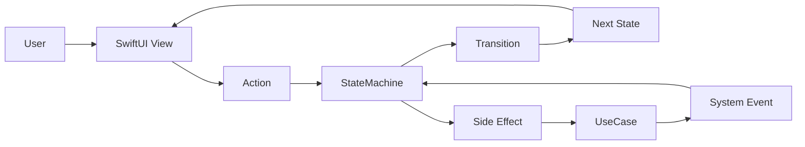

# StateObservationKit

[日本語](README.ja.md) | [Roadmap](ROADMAP.md) | [ロードマップ](ROADMAP.ja.md) | [Architecture](docs/architecture.md) | [アーキテクチャ](docs/architecture.ja.md)

> **Make architecture executable.**

StateObservationKit is a lightweight architecture foundation for SwiftUI applications.

The goal is simple.

**Design the system as a StateMachine, and implement that design as-is.**

Instead of centering the application around large ViewModels or heavy frameworks, it structures the app around explicit state transitions.

## The Problem

In many SwiftUI projects, architecture gradually collapses over time.

| Approach | Common issue |
| --- | --- |
| MVVM | Responsibilities accumulate in ViewModels, and state + business rules become entangled |
| Redux-style | Boilerplate tends to grow with scale |
| Full-stack frameworks | Powerful, but often heavy for small-to-medium teams and apps |

As a result, architecture stays in diagrams while implementation drifts elsewhere.
StateObservationKit is designed to close that gap.

## Architecture Overview



## Core Concepts

We keep `Intent` as an architectural concept, while public API guidance prioritizes `Action` / `ActionType`.

| Concept | Description |
| --- | --- |
| State | The current system state |
| Action | An event triggered by the user or the system |
| Transition | The rule that changes state |
| StateMachine | The core that executes transitions |
| Side Effect | External work such as API or storage access |
| UseCase | Domain logic that performs side effects |

## Responsibilities

| Layer | Responsibility |
| --- | --- |
| View | Renders state and sends actions |
| StateMachine | Manages state transitions |
| UseCase | Performs side effects |
| System Event | Feeds async results back into the StateMachine |

This separation keeps application logic predictable and testable.

## Architecture Comparison (MVVM / TCA / StateObservationKit)

To quickly answer "Is this just MVVM with different names?" or "How is this different from TCA?", start with this summary.

| Architecture | Design Center | Characteristic |
| --- | --- | --- |
| MVVM | ViewModel | Easy to start, but responsibilities tend to accumulate |
| TCA | Reducer / Store | Highly consistent, but concepts and boilerplate grow faster |
| StateObservationKit | StateMachine / Transition | Makes transitions explicit and maps architecture into code with less ceremony |

See [Architecture Comparison](docs/architecture_comparison.md) for diagrams, trade-offs, and adoption guidance.

## Why This Architecture Works

The core rule is simple:

> **State changes only through explicit transitions.**

That gives you:

- Visible system behavior
- Testable business logic
- Architecture and implementation that stay aligned

## Philosophy

Many architecture styles optimize mainly for organizing code. StateObservationKit optimizes for making design executable.

Architecture should not live only in documents. It should be executable in code.

## Layer Placement

```text
View
 ↓
Application State Machine
 ↓
UseCase / Domain
 ↓
Infrastructure
```

StateObservationKit is intended for the Application layer. State changes must go through machine APIs (`dispatch(_:)` / `send(_:)`), while concrete infrastructure dependencies stay outside UseCase and Environment boundaries.

## Example: Avoid Large ViewModels, Make Transitions Explicit

A method-collection ViewModel shape can hide the actual system behavior:

```swift
final class PlayerViewModel {
    func play() { /* ... */ }
    func pause() { /* ... */ }
    func stop() { /* ... */ }
}
```

StateObservationKit instead encourages explicit state and action modeling:

```swift
enum PlayerState: StateType {
    case idle
    case playing
    case paused
}

enum PlayerAction: ActionType {
    case play
    case pause
    case stop
}
```

```text
idle    --play-->  playing
playing --pause-> paused
paused  --play-->  playing
```

This makes behavior reviewable, testable, and easier to evolve safely.

## Lightweight Alternative

StateObservationKit provides a minimal architecture foundation with:

- Explicit state transitions
- Architecture-first implementation flow
- Observation-native SwiftUI integration

You can adopt it incrementally without heavy framework ceremony.

## When This Is a Good Fit

StateObservationKit is especially useful when:

- You want architecture intent to stay visible in code
- Your app has meaningful state transitions
- You want to avoid large mutable ViewModels
- You want something lighter than a full-stack framework

## Sample App Strategy (Pre-article Foundation)

To support adoption decisions, we plan sample apps as first-class onboarding assets.

### 1. TodoApp (highest priority)

- Goal: shortest path to understand `Action -> Transition -> State`
- Include:
  - add / complete / delete base transitions
  - filter switching (`all / active / completed`)
  - ScreenModel as the input boundary, with the machine focused on transitions

### 2. ChatApp

- Goal: show how to handle async events and ordering guarantees
- Include:
  - `sending / sent / failed` state modeling
  - follow-up actions and retry flow
  - tests for invalid transitions and effect failures

### 3. PlayerApp

- Goal: show how explicit media-style transitions project into UI
- Include:
  - `idle / playing / paused` transitions
  - button availability driven by `canSend(_:)`
  - simpler view code via `@Bindable` and projection

### Shared sample principles

- Prioritize recommended architecture rather than the shortest runnable demo
- Do not mutate state directly from the View; always go through machine APIs
- Include deterministic tests with `ObservationDrivenStateMachineMock`

## Current Status And Reading Order

StateObservationKit is being realigned toward the roadmap and architecture documents. That means some documentation describes the target direction while the current implementation still reflects an earlier API shape.

Use this reading order when you need to decide what to trust:

1. `ROADMAP.md` for project direction and target architecture
2. `docs/architecture.md` for design boundaries and dependency direction
3. This README for the current public API contract
4. Inline type documentation and tests for current runtime behavior

If the roadmap and current implementation differ, treat that gap as an active migration target, not as a documentation mistake.

## What the Package Provides

| Type | Purpose | Typical use |
| --- | --- | --- |
| `TransitionDrivenStateMachine` | Makes transitions and effects explicit with strongly typed `enum` definitions. | Application flows, orchestration, business logic control |
| `ObservationDrivenStateMachine` | Publishes state reactively for UI layers and serializes reducer execution. | SwiftUI-facing state machines, Observation integration, UI availability checks, and projection-driven views |
| `ObservationDrivenStateMachineMock` | Replaces async behavior with deterministic synchronous state changes for tests. | Unit tests, UI tests, previews |
| `TransitionRecorder` | Records committed transitions, actions, and state sequences in order. | Transition history assertions, debugging, follow-up action tracing |
| `StateSequenceRecorder` | Records arbitrary state snapshots with a lightweight API. | Hook-based state sequence assertions, previews, simple tracing |

## Concept Mapping

| Architectural concept | Current API | Responsibility |
| --- | --- | --- |
| State | `StateType` | Represents the current application state |
| Intent | `ActionType` | Represents user or system input |
| Transition | `TransitionType` | Defines a meaningful state change and its optional effect |
| Machine | `TransitionDrivenStateMachine` / `ObservationDrivenStateMachine` | Interprets input, executes transitions, and exposes state |

## Current Machine Contract

### `TransitionDrivenStateMachine`

- `dispatch(_:)` is the only public entry point for committing state changes.
- If the current `(state, action)` pair does not match a transition, the machine throws `TransitionDispatchError.invalidTransition` and leaves state unchanged.
- The machine runs a transition's `effect` before committing `state`.
- If the `effect` throws a non-cancellation error, the machine leaves state unchanged and throws `TransitionDispatchError.effectFailed`.
- If the `effect` returns a follow-up `Action`, the machine commits the current transition first and then dispatches the follow-up action from the new state.
- When you pass a `transitionRecorder`, the machine records only committed transitions. Invalid transitions and effect failures do not pollute the history.

### `ObservationDrivenStateMachine`

- `dispatch(_:)` returns immediately and schedules reducer execution asynchronously.
- `send(_:)` enqueues work on the same ordered queue and returns after the resulting state has been published.
- `canSend(_:)` returns a conservative UI-facing availability check based on the published state and whether reducer work is still pending.
- Reducer execution is serialized on an ordered internal queue, so `dispatch(_:)` and `send(_:)` are applied in call order.
- `state` is updated on the main actor after each reducer run completes.
- `dispatch(_:)` remains the fire-and-forget API; use `send(_:)` when tests or orchestration code need an explicit completion point.

## Example: Explicit Transitions

```swift
enum PlayerState: StateType {
    case idle
    case playing
    case paused
}

enum PlayerAction: ActionType {
    case play
    case pause
}

enum PlayerTransition: TransitionType {
    typealias State = PlayerState
    typealias Action = PlayerAction

    case idlePlay
    case playingPause

    var from: PlayerState {
        switch self {
        case .idlePlay: return .idle
        case .playingPause: return .playing
        }
    }

    var action: PlayerAction {
        switch self {
        case .idlePlay: return .play
        case .playingPause: return .pause
        }
    }

    var to: PlayerState {
        switch self {
        case .idlePlay: return .playing
        case .playingPause: return .paused
        }
    }

    var effect: (@Sendable () async throws -> PlayerAction?)? { nil }
}

let machine = TransitionDrivenStateMachine<PlayerTransition>(initial: .idle)
try await machine.dispatch(.play)
print(await machine.state) // playing
```

`dispatch(_:)` is the only entry point for state changes. If an effect returns a follow-up `Action`, the machine dispatches it after the current transition has been committed.

As a thin Q4 production/testing utility, `TransitionRecorder` and `StateSequenceRecorder` let you inspect committed history without changing control flow:

```swift
let transitions = TransitionRecorder<PlayerTransition>()
let states = StateSequenceRecorder<PlayerState>()

let machine = TransitionDrivenStateMachine<PlayerTransition>(
    initial: .idle,
    hook: { states.record($0) },
    transitionRecorder: transitions
)

try await machine.dispatch(.play)

print(transitions.actions)       // [.play]
print(transitions.stateSequence) // [.idle, .playing]
print(states.snapshot)           // [.idle, .playing]
```

Because `TransitionRecorder` records only committed state changes, tests that involve failing effects can assert the confirmed history directly.

## Example: Observation-Friendly State

```swift
let machine = ObservationDrivenStateMachine<PlayerState, PlayerAction>(
    initial: .idle,
    canSend: { state, action in
        switch (state, action) {
        case (.idle, .play), (.playing, .pause), (.paused, .play):
            return true
        default:
            return false
        }
    }
) { state, action in
    switch (state, action) {
    case (.idle, .play):
        state = .playing
    case (.idle, .pause):
        break
    case (.playing, .play):
        break
    case (.playing, .pause):
        state = .paused
    case (.paused, .play):
        state = .playing
    case (.paused, .pause):
        break
    }
}

let committedState = await machine.send(.play)
print(committedState) // playing
```

On platforms that support Observation, the machine can be used naturally from SwiftUI:

```swift
struct PlayerView: View {
    @Bindable var machine: ObservationDrivenStateMachine<PlayerState, PlayerAction>

    var body: some View {
        let viewState = machine.project(PlayerControls.init)

        VStack {
            Text("\(String(describing: machine.state))")
            Button(viewState.primaryTitle) {
                Task {
                    _ = await machine.send(viewState.primaryAction)
                }
            }
                .disabled(!machine.canSend(viewState.primaryAction))
        }
    }
}

struct PlayerControls {
    let primaryTitle: String
    let primaryAction: PlayerAction

    init(state: PlayerState) {
        switch state {
        case .idle, .paused:
            self.primaryTitle = "Play"
            self.primaryAction = .play
        case .playing:
            self.primaryTitle = "Pause"
            self.primaryAction = .pause
        }
    }
}
```

When a control needs a `Binding`, use `binding(_:send:)` to map value changes back into actions.

```swift
TextField(
    "Title",
    text: machine.binding(\.draftTitle, send: EditorAction.titleChanged)
)
```

The snippet above is the smallest possible example, so the View talks to the machine directly. In the package sample, SwiftUI input goes through a ScreenModel-style `send(_:)` method first, and that wrapper decides when to call `dispatch(_:)`. Use that shape when side effects, `Result` handling, or follow-up actions should stay out of the View.

## Documentation

### Core

- [Roadmap](ROADMAP.md)
- [Japanese Roadmap](ROADMAP.ja.md)
- [Architecture](docs/architecture.md)
- [Japanese Architecture](docs/architecture.ja.md)
- [Usage](docs/usage.md)
- [Philosophy](docs/philosophy.md)

### Design Guides

- [Architecture Comparison](docs/architecture_comparison.md)
- [Japanese Architecture Comparison](docs/architecture_comparison.ja.md)
- [StateMachine Design Guide](docs/state_machine_design_guide.md)
- [Japanese StateMachine Design Guide](docs/state_machine_design_guide.ja.md)
- [Feature Design Sheet v1 Template](docs/templates/feature_design_sheet_v1.md)
- [Feature Design Sheet v1 Sample](docs/templates/feature_design_sheet_v1.sample.md)
- [Japanese Feature Design Sheet v1 Template](docs/templates/feature_design_sheet_v1.ja.md)
- [Japanese Feature Design Sheet v1 Sample](docs/templates/feature_design_sheet_v1.sample.ja.md)

### Contribution / Practice

- [Best Practices](docs/best_practices.md)
- [Contributing](docs/contributing.md)
- [Integration Examples](docs/integration_examples.md)
- [Q1 Execution Plan (Japanese)](docs/q1_execution_plan.ja.md)
- [Q2 Execution Plan (Japanese)](docs/q2_execution_plan.ja.md)

### README

- [Japanese README](README.ja.md)

## 2026 Roadmap Snapshot

| Quarter | Focus |
| --- | --- |
| 2026 Q1 | Core architecture stabilization |
| 2026 Q2 | Clean Architecture integration |
| 2026 Q3 | SwiftUI ergonomics and tooling |
| 2026 Q4 | Production readiness and ecosystem |

See [ROADMAP.md](ROADMAP.md) for the detailed plan and guiding principles.

## Testing

```bash
swift test
swift build -Xswiftc -strict-concurrency=complete
```

Where Observation and SwiftUI are available, the sample UI integration is also validated as part of the package build.

## Platform Support

- iOS 17+
- macOS 14+

## License

See [LICENSE](LICENSE).
