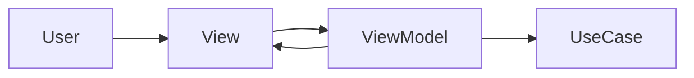
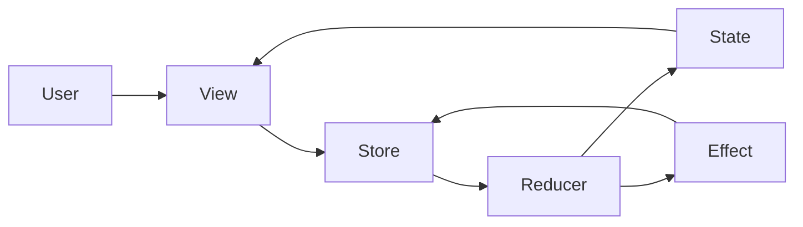
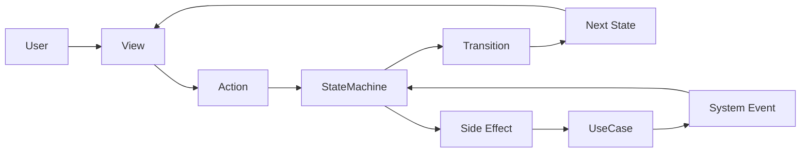

# アーキテクチャ比較（MVVM / TCA / StateObservationKit）

StateObservationKit は、すべてのアーキテクチャを置き換えることを目的としていません。

このライブラリは、次のような要求に向いています。

- 状態遷移を明示したい
- 軽量な構成を保ちたい
- 設計をそのまま実装へ落とし込みたい
- 重いフレームワークなしでテストしやすくしたい

---

## 全体比較

| アーキテクチャ | 強み | 弱み | 向いているケース |
|---|---|---|---|
| MVVM | 始めやすい | ViewModel に責務が集まりやすい | 小規模・単純な画面 |
| TCA | 一貫性とテスト性が高い | ボイラープレートと学習コストが高い | 長期運用・大規模アプリ |
| StateObservationKit | 状態遷移が明示的で軽量 | StateMachine 前提の設計思考が必要 | 構造を保ちつつ軽量に実装したいアプリ |

---

## 設計の中心

| アーキテクチャ | 設計の中心 |
|---|---|
| MVVM | ViewModel |
| TCA | Reducer / Store |
| StateObservationKit | StateMachine / Transition |

StateObservationKit は、**状態遷移そのもの** を設計の中心に置きます。

---

## 責務比較

| 観点 | MVVM | TCA | StateObservationKit |
|---|---|---|---|
| UI 描画 | View | View | View |
| UI 操作の受付 | ViewModel | Store / Reducer | ScreenModel / Action |
| 状態遷移 | ViewModel 内に暗黙的に入りやすい | Reducer | StateMachine |
| 副作用 | ViewModel や UseCase に混ざりやすい | Effect / Dependency | UseCase |
| 設計との対応関係 | 弱い | 強い | 強い |
| ボイラープレート | 初期は少ないが後で増えやすい | 多い | 中〜少 |

---

## 比較図

### MVVM

- 始めやすい
- 小さい機能なら速い
- ViewModel に責務が集まりやすい

### TCA

- 一貫性が強い
- エコシステムが豊富
- 概念数とボイラープレートが多い

### StateObservationKit

- 状態遷移が明示的
- View を薄く保ちやすい
- 副作用を StateMachine の外に置ける
- 設計を実装へ自然に写像しやすい

---

## どう使い分けるか

### MVVM を選ぶとよいケース

- 機能が小さい
- 状態遷移が単純
- まず素早く作りたい

### TCA を選ぶとよいケース

- アプリが大規模
- チーム全体で厳密な一貫性が必要
- 豊富な周辺ツールも活用したい

### StateObservationKit を選ぶとよいケース

- 設計をコード上に見える形で保ちたい
- 機能を状態と遷移で表現できる
- TCA ほど重くしたくない
- ViewModel 肥大化を避けたい

---

## 一言でいうと

| アーキテクチャ | 一言 |
|---|---|
| MVVM | ViewModel 中心にロジックを組み立てる |
| TCA | Reducer と Store 中心に状態変更を管理する |
| StateObservationKit | StateMachine と Transition 中心に設計を実装へ落とし込む |

---

## 哲学の違い

- MVVM が考える問い: UI ロジックをどこに置くか
- TCA が考える問い: 状態変更をどう一貫して管理するか
- StateObservationKit が考える問い: 設計したアーキテクチャを、どうそのままコードとして実行可能にするか

---

## 結論

StateObservationKit は、あらゆるケースで最適なアーキテクチャではありません。

ただし次の目的には強く適しています。

**状態駆動の設計を、明示的に、軽量に、実装可能な形で保つこと。**
