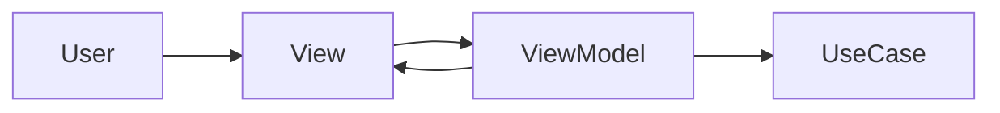
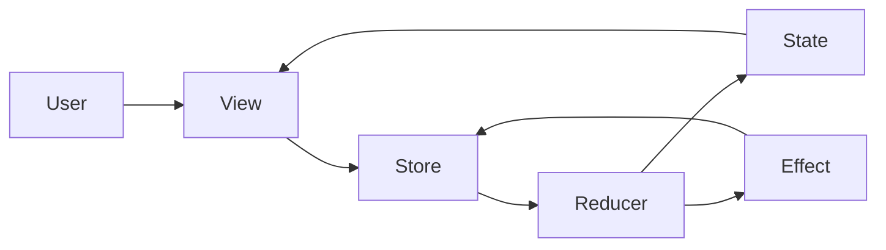
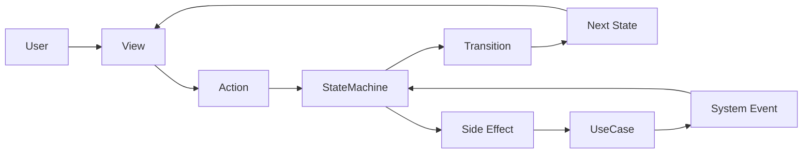

# Architecture Comparison (MVVM / TCA / StateObservationKit)

StateObservationKit is not intended to replace every architecture.

It is a strong fit when teams want to:

- make state transitions explicit
- keep the architecture lightweight
- map design decisions directly into implementation
- keep testability without heavy framework overhead

---

## High-level Comparison

| Architecture | Strength | Weakness | Best fit |
|---|---|---|---|
| MVVM | Easy to start | Responsibilities tend to accumulate in ViewModel | Small and simple screens |
| TCA | Strong consistency and testability | Boilerplate and learning cost can be high | Large, long-lived applications |
| StateObservationKit | Explicit transitions with lightweight structure | Requires state-machine-first design thinking | Teams that need structure without full framework weight |

---

## Design Center

| Architecture | Design center |
|---|---|
| MVVM | ViewModel |
| TCA | Reducer / Store |
| StateObservationKit | StateMachine / Transition |

StateObservationKit puts **state transitions themselves** at the center of design.

---

## Responsibility Comparison

| Concern | MVVM | TCA | StateObservationKit |
|---|---|---|---|
| UI rendering | View | View | View |
| UI interaction entry | ViewModel | Store / Reducer | ScreenModel / Action |
| State transitions | Often implicit in ViewModel | Reducer | StateMachine |
| Side effects | Often mixed in ViewModel/UseCase | Effect / Dependency | UseCase |
| Design traceability | Weak | Strong | Strong |
| Boilerplate | Low at first, often grows later | High | Medium to low |

---

## Comparison Diagrams

### MVVM

- Easy to start
- Fast for small features
- Responsibilities often drift into ViewModel

### TCA

- Very strong consistency
- Rich ecosystem
- More concepts and boilerplate

### StateObservationKit

- Explicit transitions
- Keeps View thin
- Keeps side effects outside StateMachine
- Maps architecture naturally to implementation

---

## How to Choose

### Choose MVVM when

- the feature is small
- transition complexity is low
- implementation speed matters most

### Choose TCA when

- the application is large and long-lived
- strict team-wide consistency is required
- you want the full ecosystem of tooling and patterns

### Choose StateObservationKit when

- you want architecture to remain visible in code
- features can be modeled as state + transition
- you want something lighter than TCA
- you want to avoid large ViewModels

---

## One-sentence Summary

| Architecture | Summary |
|---|---|
| MVVM | Center logic around ViewModels |
| TCA | Center state change around Reducers and Stores |
| StateObservationKit | Center design around StateMachines and Transitions |

---

## Philosophy Difference

- MVVM asks: where should UI logic live?
- TCA asks: how should state changes be managed consistently?
- StateObservationKit asks: how can architectural design become executable in code?

---

## Conclusion

StateObservationKit is not universally best for every case.

It is best suited to this goal:

**Keep state-driven architecture explicit, lightweight, and directly implementable.**
