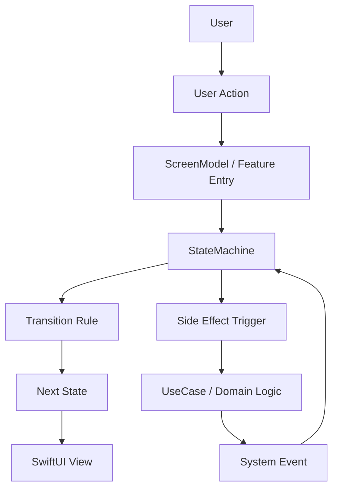
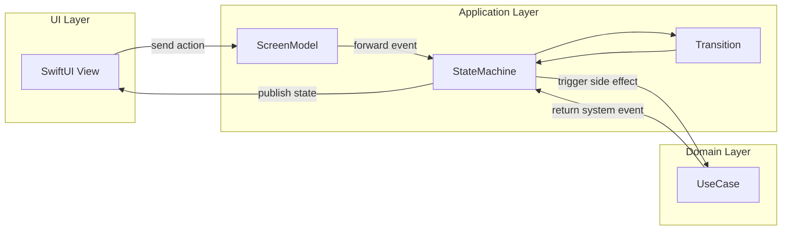
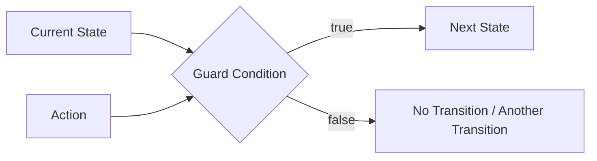
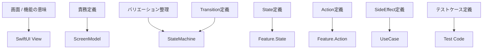
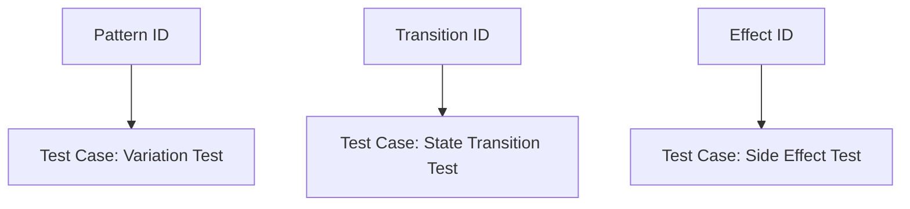
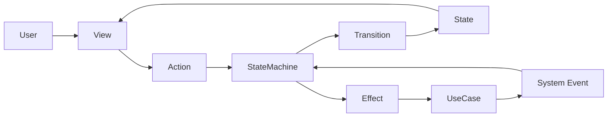

# StateMachine Design Guide

このドキュメントは、StateObservationKit を使用する際の **StateMachine 設計ルール** を定義します。

目的は次の 3 つです。

- 状態設計の一貫性を保つ
- 状態遷移の可読性を維持する
- テスト可能な設計を維持する

---

## 1. State 設計ルール

State は **システムの状態** を表します。

UI 状態ではなく、**システムの意味的状態** を表現してください。

### GOOD

- `idle`
- `loading`
- `loaded`
- `failed`

### BAD

- `showSpinner`
- `showErrorLabel`

UI 状態は View 側で表現し、StateMachine には意味的状態を置きます。

---

## 2. State 設計アンチパターン

### 2.1 Boolean Explosion

#### BAD

- `isLoading`
- `hasError`
- `hasData`
- `isEmpty`

これらは組み合わせ爆発を起こしやすく、無効状態を増やします。

#### GOOD

- `idle`
- `loading`
- `loaded`
- `failed`
- `empty`

### 2.2 Data Driven State

#### BAD

- `items: [Item]` の有無だけで状態を判断する

#### GOOD

- `loading`
- `loaded(items)`
- `empty`

### 2.3 UI Driven State

#### BAD

- `showPaywall`
- `showLogin`

UI は状態の結果であり、状態そのものではありません。

#### GOOD

- `unauthorized`
- `premiumRequired`

### 2.4 Mega State

#### BAD

- `ready` の 1 状態に表示・遷移・制御を詰め込む

#### GOOD

- `idle`
- `editing`
- `saving`
- `completed`

---

## 3. Transition 設計ルール

Transition は次の形で定義します。

`Current State + Action + Guard -> Next State`

> 現行公開 API の語彙に合わせ、入力は `Action` として表現します。

### Guard 条件を明示する

- `loaded + purchaseTapped` かつ `user == premium` -> `purchasing`
- `loaded + purchaseTapped` かつ `user == free` -> `paywall`

### Transition は表で管理する

| Current | Action | Guard | Next |
|---|---|---|---|
| idle | onAppear | | loading |
| loading | loadSucceeded | | loaded |
| loading | loadFailed | | failed |

これにより、次を一致させやすくなります。

- テストケース
- 実装
- 仕様

---

## 4. SideEffect 設計ルール

副作用は **StateMachine 外部** に置きます。

- StateMachine の役割: 状態遷移
- UseCase の役割: 副作用

### GOOD

`loading -> fetchItems() -> loadSucceeded`

### BAD

StateMachine の内部で API 呼び出しの実装詳細を直接扱う。

---

## 5. バリエーション設計ルール

バリエーションは 3 種類に分類します。

| 種類 | 例 |
|---|---|
| ユーザー | 無料 / 有料 |
| 状態 | 初回 / 空データ |
| 環境 | ネットワークなし |

差分をどこで扱うかを明確にします。

1. Transition Guard
2. State
3. View

---

## 6. StateMachine 設計の原則

1. StateMachine は **状態遷移のみ** を責務として持つ
2. Action は **イベント** を表す
3. State は **システム状態** を表す
4. 副作用は **UseCase** に置く

---

## 7. テスト設計ルール

テストは次の 3 種類で構成します。

| 種類 | 内容 |
|---|---|
| State Test | 状態遷移 |
| Variation Test | バリエーション |
| Effect Test | 副作用 |

### State Test

- Given `idle`
- When `onAppear`
- Then `loading`

### Variation Test

- Given `free user`
- When `purchaseTapped`
- Then `paywall`

### Effect Test

- `fetchItems` success -> `loadSucceeded`
- `fetchItems` failure -> `loadFailed`

---

## 8. 設計のゴール

StateMachine 設計のゴールは、次を一致させることです。

`設計 -> State -> Transition -> Test -> Implementation`

設計書と実装の乖離を最小化することが重要です。

---

## 9. 理解のための最小フロー図

```text
User
 ↓
Action
 ↓
StateMachine
 ↓
Transition
 ↓
State
 ↓
View
```

---

## 10. StateMachine Architecture Overview（設計図）

設計・実装・自動テストの対応関係を、図で一気に把握するためのセクションです。

### 10.1 全体像



### 10.2 レイヤーごとの責務



### 10.3 状態遷移の基本形



### 10.4 設計から実装への対応



### 10.5 テストとの対応関係



### 10.6 1枚で見る責務分離



### 10.7 この図が伝えること

- View は State を描画し Action を送る
- StateMachine は状態遷移を責務に持つ
- UseCase は副作用を責務に持つ
- System Event により非同期結果を再び StateMachine に戻す
- 設計時に定義した State / Action / Transition / Effect を、そのまま実装とテストに対応づける

### 10.8 設計の一文要約

StateObservationKit では、**設計した状態遷移をそのまま実装とテストに反映する**ことを重視します。
