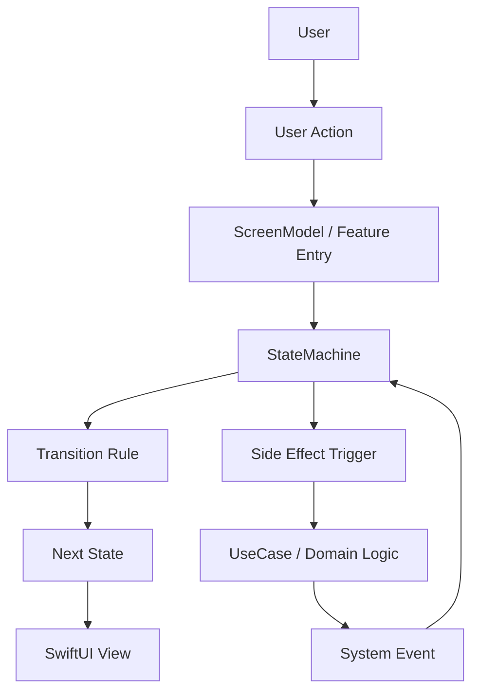
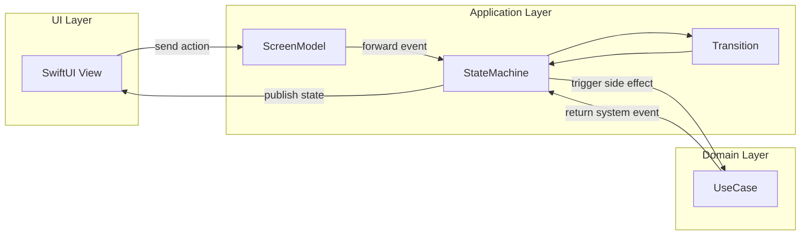
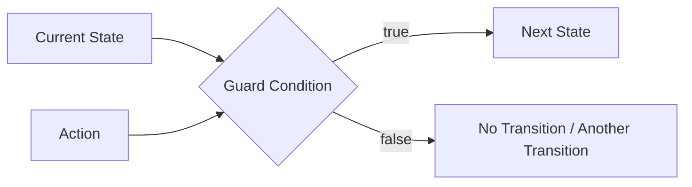
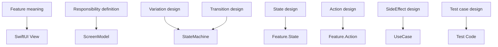
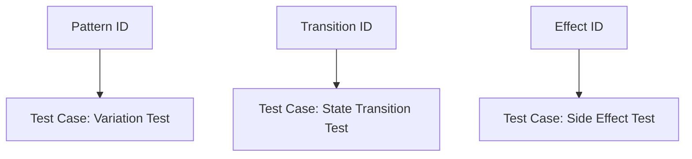
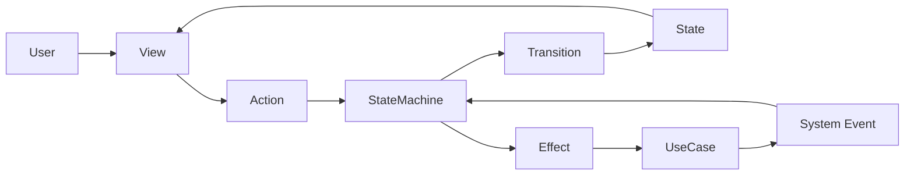

# StateMachine Design Guide

This document defines **StateMachine design rules** for StateObservationKit.

Goals:

- keep state design consistent
- keep transitions readable
- keep design testable

---

## 1. State Design Rules

State represents the **system state**.

Do not model raw UI toggles as state names; model semantic system states.

### GOOD

- `idle`
- `loading`
- `loaded`
- `failed`

### BAD

- `showSpinner`
- `showErrorLabel`

UI presentation should be derived in View.

---

## 2. State Anti-patterns

### 2.1 Boolean Explosion

#### BAD

- `isLoading`
- `hasError`
- `hasData`
- `isEmpty`

These combinations create invalid/ambiguous states.

#### GOOD

- `idle`
- `loading`
- `loaded`
- `failed`
- `empty`

### 2.2 Data-driven State

#### BAD

- infer state only from `items: [Item]`

#### GOOD

- `loading`
- `loaded(items)`
- `empty`

### 2.3 UI-driven State

#### BAD

- `showPaywall`
- `showLogin`

UI is a result of state, not the state itself.

#### GOOD

- `unauthorized`
- `premiumRequired`

### 2.4 Mega State

#### BAD

- put rendering/transition/control in one generic state like `ready`

#### GOOD

- `idle`
- `editing`
- `saving`
- `completed`

---

## 3. Transition Rules

Define transitions as:

`Current State + Action + Guard -> Next State`

> Public API wording should prioritize `Action` / `ActionType`.

### Make guard conditions explicit

- `loaded + purchaseTapped` and `user == premium` -> `purchasing`
- `loaded + purchaseTapped` and `user == free` -> `paywall`

### Manage transitions in a table

| Current | Action | Guard | Next |
|---|---|---|---|
| idle | onAppear | | loading |
| loading | loadSucceeded | | loaded |
| loading | loadFailed | | failed |

This keeps tests, implementation, and spec aligned.

---

## 4. SideEffect Rules

Keep side effects **outside** the StateMachine.

- StateMachine: transition control
- UseCase: side-effect execution

### GOOD

`loading -> fetchItems() -> loadSucceeded`

### BAD

Implement API call details directly inside StateMachine.

---

## 5. Variation Rules

Classify variations into three types:

| Type | Example |
|---|---|
| User | free / premium |
| State | first launch / empty data |
| Environment | offline |

Decide where each variation is handled:

1. Transition Guard
2. State
3. View

---

## 6. StateMachine Principles

1. StateMachine is responsible for transitions
2. Action represents events
3. State represents system state
4. Side effects live in UseCase

---

## 7. Testing Rules

Use three test groups:

| Type | Focus |
|---|---|
| State Test | transition behavior |
| Variation Test | variation branches |
| Effect Test | side-effect results |

### State Test

- Given `idle`
- When `onAppear`
- Then `loading`

### Variation Test

- Given `free user`
- When `purchaseTapped`
- Then `paywall`

### Effect Test

- `fetchItems` success -> `loadSucceeded`
- `fetchItems` failure -> `loadFailed`

---

## 8. Design Goal

Align the chain below end-to-end:

`Design -> State -> Transition -> Test -> Implementation`

The key is minimizing drift between architecture and code.

---

## 9. Minimal Flow

```text
User
 ↓
Action
 ↓
StateMachine
 ↓
Transition
 ↓
State
 ↓
View
```

---

## 10. StateMachine Architecture Overview

### 10.1 System flow



### 10.2 Layer responsibilities



### 10.3 Transition core shape



### 10.4 Design-to-implementation mapping



### 10.5 Traceability to tests



### 10.6 Responsibility split on one page



### 10.7 What this diagram communicates

- The View renders State and sends Actions
- The StateMachine owns state transitions
- The UseCase owns side effects
- System Events route async results back into the StateMachine
- State / Action / Transition / Effect defined during design map directly into implementation and tests

### 10.8 One-sentence design summary

StateObservationKit prioritizes **reflecting designed state transitions directly in implementation and tests**.
