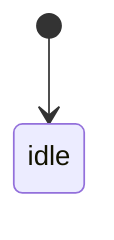

# Feature Design Sheet v1（テンプレート）

> このテンプレートは **情報設計・状態設計・実装設計・自動テスト設計** を一貫してつなぐことを目的とします。  
> 対象は StateMachine 駆動で実装する機能です。  
> 打鍵テストや受け入れテストは対象外とします。

---

## 設計フロー（Design → Implementation → Automated Test）

情報設計  
↓  
責務定義  
↓  
バリエーション整理  
↓  
入出力定義  
↓  
State 設計  
↓  
Transition 設計  
↓  
SideEffect 設計  
↓  
実装マッピング  
↓  
自動テスト設計  
↓  
バージョン管理

---

## 1. 基本情報

| 項目 | 内容 |
|---|---|
| 機能名 | |
| 機能ID | |
| 対象モジュール | |
| 作成日 | |
| 更新日 | |
| 作成者 | |
| 関連画面 | |
| 関連Issue | |

---

## 2. 画面 / 機能の意味（情報設計）

> 実装ではなく **ユーザー体験上の役割** を定義する

### この画面 / 機能の役割

- ユーザーに何を理解させる画面か
- ユーザーに何を選択 / 実行させる画面か
- どの体験フローの一部か

### ユーザーにとっての目的

- この画面を開く理由
- この画面で達成したいこと

### 扱う情報

| 種別 | 内容 |
|---|---|
| 主情報 | |
| 補助情報 | |

### 扱わない情報

- 他機能の状態
- 他ドメインのデータ

---

## 3. 責務定義

> この機能が **管理する境界** を明確にする

### この機能が責務として持つもの

- 管理する状態
- 受け付けるユーザー操作
- 表示切り替えの判断
- 状態遷移
- 異常系処理

### この機能が持たない責務

- 永続化の詳細
- API 実装
- 他画面の状態
- UI 部品の見た目

### 責務チェック

| 観点 | 内容 |
|---|---|
| 管理対象 | |
| 入力（Action） | |
| 出力（State / Route / Message） | |
| 境界（UseCase / Infrastructure との分離） | |
| 例外（失敗時方針） | |

---

## 4. バリエーション設計

> **機能差分 / 状態差分 / ユーザー差分** を整理する

### 利用者バリエーション

| Pattern ID | 条件 | 説明 |
|---|---|---|
| PAT-001 | | |
| PAT-002 | | |

### データ / 状態バリエーション

| Pattern ID | 条件 | 説明 |
|---|---|---|
| PAT-101 | | |
| PAT-102 | | |

### 差分整理

| 観点 | パターンA | パターンB |
|---|---|---|
| 表示 | | |
| 操作 | | |
| 遷移 | | |

---

## 5. 入出力定義

### 入力

| 項目 | 型 | 必須 | 説明 |
|---|---|---|---|
| | | Yes/No | |

### 出力

| 項目 | 型 | 説明 |
|---|---|---|
| state | FeatureState | UI 描画用 |
| route | Route? | 画面遷移 |
| message | Message? | 通知 |

---

## 6. Actions / Events

> 現行公開 API に合わせ、入力は `Action` として扱う

### User Actions

| Action | 説明 |
|---|---|
| onAppear | |

### System Events

| Action | 説明 |
|---|---|
| loadSucceeded | |
| loadFailed | |

---

## 7. State 設計

| State | 説明 | UI 意味 | この State を持つ理由 |
|---|---|---|---|
| idle | 初期状態 | 初期画面 | 初回処理前 |

---

## 8. 状態遷移

### Transition Table

| Transition ID | Current | Action | Guard | Next | 備考 |
|---|---|---|---|---|---|
| TR-001 | | | | | |

### State Diagram

---

## 9. Side Effects

| Effect ID | Effect | Trigger (Transition ID) | 説明 | Success Action | Failure Action |
|---|---|---|---|---|---|
| EF-001 | | | | | |

---

## 10. 実装マッピング

| 設計要素 | 実装 |
|---|---|
| Feature | Screen / Module |
| State | Feature.State |
| Action | Feature.Action |
| Transition | StateMachine |
| Side Effect | UseCase |
| 表示 | SwiftUI View |

---

## 11. 自動テスト設計

> このセクションを **テストコードの元データ** として扱う

### 状態遷移テスト

| TC ID | Transition ID | Given | When | Then |
|---|---|---|---|---|
| TC-001 | TR-001 | | | |

### バリエーションテスト

| TC ID | Pattern ID | 条件 | 期待 |
|---|---|---|---|
| TC-101 | PAT-001 | | |

### 副作用テスト

| TC ID | Effect ID | 観点 |
|---|---|---|
| TC-201 | EF-001 | 成功 |
| TC-202 | EF-001 | 失敗 |

### 設計要素トレーサビリティ

| TC ID | Feature | Pattern | Transition | Effect |
|---|---|---|---|---|
| TC-001 | FEAT-001 | | TR-001 | |

---

## 12. バージョン別機能管理

| Feature ID | 機能 | ステータス | 追加Ver | 削除Ver |
|---|---|---|---|---|
| FEAT-001 | | Active / Deprecated / Removed | | |

---

## 13. 未決事項

| 項目 | 内容 | 優先度 |
|---|---|---|
| | | |

---

## 14. レビュー

| 役割 | 名前 | 日付 |
|---|---|---|
| Designer | | |
| Reviewer | | |
| Developer | | |

---

## このテンプレートの狙い

次の対応を ID でトレース可能にします。

`Feature -> State -> Transition -> Effect -> TestCase`

これにより、次の漏れを抑制します。

- 実装漏れ
- テスト漏れ
- バリエーション漏れ
