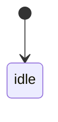

# Feature Design Sheet v1 (Template)

> This template connects **information design, state design, implementation design, and automated test design**.
> It is intended for features implemented with a StateMachine-driven approach.

---

## Design Flow (Design -> Implementation -> Automated Test)

Information design  
↓  
Responsibility definition  
↓  
Variation design  
↓  
Input/Output definition  
↓  
State design  
↓  
Transition design  
↓  
SideEffect design  
↓  
Implementation mapping  
↓  
Automated test design  
↓  
Versioning

---

## 1. Basic Information

| Item | Content |
|---|---|
| Feature Name | |
| Feature ID | |
| Target Module | |
| Created At | |
| Updated At | |
| Author | |
| Related Screen | |
| Related Issue | |

## 2. Feature Meaning (Information Design)

### Role

- What should users understand here?
- What should users choose or execute?
- Which part of the user journey is this?

### User Goal

- Why do users open this feature?
- What do they want to accomplish?

### In-scope Information

| Type | Content |
|---|---|
| Primary | |
| Secondary | |

### Out-of-scope Information

- states from other features
- data from other domains

## 3. Responsibility Definition

### This feature is responsible for

- state it manages
- user operations it accepts
- display-switch decisions
- state transitions
- error handling

### This feature is NOT responsible for

- persistence details
- API implementation details
- other screen states
- visual styling of UI components

### Responsibility Checklist

| Viewpoint | Content |
|---|---|
| Managed subject | |
| Input (Action) | |
| Output (State / Route / Message) | |
| Boundary (UseCase / Infrastructure split) | |
| Exception policy | |

## 4. Variation Design

### User Variations

| Pattern ID | Condition | Description |
|---|---|---|
| PAT-001 | | |
| PAT-002 | | |

### Data/State Variations

| Pattern ID | Condition | Description |
|---|---|---|
| PAT-101 | | |
| PAT-102 | | |

### Difference Matrix

| Viewpoint | Pattern A | Pattern B |
|---|---|---|
| Rendering | | |
| Operation | | |
| Transition | | |

## 5. Input / Output Definition

### Input

| Item | Type | Required | Description |
|---|---|---|---|
| | | Yes/No | |

### Output

| Item | Type | Description |
|---|---|---|
| state | FeatureState | for UI rendering |
| route | Route? | navigation |
| message | Message? | user notification |

## 6. Actions / Events

### User Actions

| Action | Description |
|---|---|
| onAppear | |

### System Events

| Action | Description |
|---|---|
| loadSucceeded | |
| loadFailed | |

## 7. State Design

| State | Description | UI Meaning | Why this state exists |
|---|---|---|---|
| idle | Initial state | Initial UI | Before first trigger |

## 8. Transitions

### Transition Table

| Transition ID | Current | Action | Guard | Next | Notes |
|---|---|---|---|---|---|
| TR-001 | | | | | |

### State Diagram

## 9. Side Effects

| Effect ID | Effect | Trigger (Transition ID) | Description | Success Action | Failure Action |
|---|---|---|---|---|---|
| EF-001 | | | | | |

## 10. Implementation Mapping

| Design Element | Implementation |
|---|---|
| Feature | Screen / Module |
| State | Feature.State |
| Action | Feature.Action |
| Transition | StateMachine |
| Side Effect | UseCase |
| UI Rendering | SwiftUI View |

## 11. Automated Test Design

### State Transition Tests

| TC ID | Transition ID | Given | When | Then |
|---|---|---|---|---|
| TC-001 | TR-001 | | | |

### Variation Tests

| TC ID | Pattern ID | Condition | Expectation |
|---|---|---|---|
| TC-101 | PAT-001 | | |

### Side Effect Tests

| TC ID | Effect ID | Viewpoint |
|---|---|---|
| TC-201 | EF-001 | success |
| TC-202 | EF-001 | failure |

### Design Traceability

| TC ID | Feature | Pattern | Transition | Effect |
|---|---|---|---|---|
| TC-001 | FEAT-001 | | TR-001 | |

## 12. Versioned Feature Management

| Feature ID | Feature | Status | Added Ver | Removed Ver |
|---|---|---|---|---|
| FEAT-001 | | Active / Deprecated / Removed | | |

## 13. Open Questions

| Item | Content | Priority |
|---|---|---|
| | | |

## 14. Review

| Role | Name | Date |
|---|---|---|
| Designer | | |
| Reviewer | | |
| Developer | | |

---

## Template Goal

Make this chain traceable by ID:

`Feature -> State -> Transition -> Effect -> TestCase`

This reduces:

- implementation gaps
- testing gaps
- variation coverage gaps
