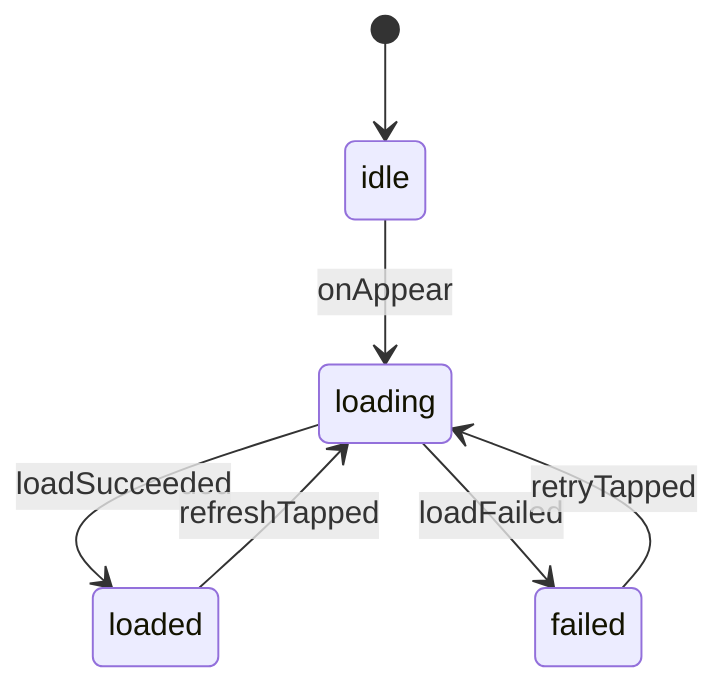

# Feature Design Sheet v1（サンプル）

> 対象例: Todo 一覧の初回ロード + 手動リフレッシュ

---

## 1. 基本情報

| 項目 | 内容 |
|---|---|
| 機能名 | Todo一覧ロード |
| 機能ID | FEAT-TODO-001 |
| 対象モジュール | TodoFeature |
| 作成日 | 2026-03-08 |
| 更新日 | 2026-03-08 |
| 作成者 | Team StateObservation |
| 関連画面 | TodoListScreen |
| 関連Issue | #123 |

## 2. 画面 / 機能の意味（情報設計）

### この画面 / 機能の役割

- ユーザーに現在の ToDo 状況を一覧で理解させる
- リフレッシュ操作で最新状態に更新させる
- タスク管理フローの入口として機能する

### ユーザーにとっての目的

- 今やるべきタスクを把握する
- 更新失敗時に再試行する

### 扱う情報

| 種別 | 内容 |
|---|---|
| 主情報 | Todo 項目一覧 |
| 補助情報 | 最終更新時刻 / エラーメッセージ |

### 扱わない情報

- タスク編集画面のローカル入力状態
- 課金状態など別ドメイン情報

## 3. 責務定義

### この機能が責務として持つもの

- ロード中 / 成功 / 失敗の状態管理
- `onAppear` / `refreshTapped` / `retryTapped` の受付
- 状態遷移と失敗時のリカバリー

### この機能が持たない責務

- API 通信実装（UseCase / Repository 側で実装）
- 永続化方式の選定

### 責務チェック

| 観点 | 内容 |
|---|---|
| 管理対象 | Todo 一覧取得フロー |
| 入力（Action） | onAppear / refreshTapped / retryTapped / loadSucceeded / loadFailed |
| 出力（State / Route / Message） | state / message |
| 境界（UseCase / Infrastructure との分離） | `FetchTodoListUseCaseProtocol` で抽象化 |
| 例外（失敗時方針） | `failed` に遷移し再試行可能 |

## 4. バリエーション設計

### 利用者バリエーション

| Pattern ID | 条件 | 説明 |
|---|---|---|
| PAT-001 | 通常ユーザー | 全タスク表示 |
| PAT-002 | 読み取り専用ユーザー | 更新操作を無効化 |

### データ / 状態バリエーション

| Pattern ID | 条件 | 説明 |
|---|---|---|
| PAT-101 | 初回利用 | 空状態プレースホルダ表示 |
| PAT-102 | データ0件 | Empty View 表示 |

### 差分整理

| 観点 | 通常ユーザー | 読み取り専用ユーザー |
|---|---|---|
| 表示 | 一覧 + 更新ボタン | 一覧のみ |
| 操作 | refresh / retry 可 | refresh 不可、retry のみ可 |
| 遷移 | loaded -> loading あり | loaded -> loading なし |

## 5. 入出力定義

### 入力

| 項目 | 型 | 必須 | 説明 |
|---|---|---|---|
| userMode | UserMode | Yes | 利用者種別 |
| initialItems | [TodoItem]? | No | 初期描画用キャッシュ |

### 出力

| 項目 | 型 | 説明 |
|---|---|---|
| state | TodoFeature.State | UI 描画用 |
| route | TodoRoute? | 詳細遷移 |
| message | ToastMessage? | 通知 |

## 6. Actions / Events

### User Actions

| Action | 説明 |
|---|---|
| onAppear | 初回表示時にロード開始 |
| refreshTapped | 手動更新 |
| retryTapped | 失敗後再試行 |

### System Events

| Action | 説明 |
|---|---|
| loadSucceeded(items) | 取得成功 |
| loadFailed(error) | 取得失敗 |

## 7. State 設計

| State | 説明 | UI 意味 | この State を持つ理由 |
|---|---|---|---|
| idle | 初期状態 | 空画面 / skeleton | 初回トリガ前 |
| loading | 取得中 | ローディング表示 | 重複操作防止 |
| loaded([TodoItem]) | 表示可能 | 一覧表示 | 正常系 |
| failed(ErrorViewData) | 失敗 | エラー + 再試行 | 回復可能な異常系 |

## 8. 状態遷移

### Transition Table

| Transition ID | Current | Action | Guard | Next | 備考 |
|---|---|---|---|---|---|
| TR-001 | idle | onAppear | | loading | 初回ロード |
| TR-002 | loading | loadSucceeded | items.count > 0 | loaded | 一覧表示 |
| TR-003 | loading | loadSucceeded | items.isEmpty | loaded | Empty View 表示 |
| TR-004 | loading | loadFailed | | failed | 失敗表示 |
| TR-005 | loaded | refreshTapped | userMode == normal | loading | 再取得 |
| TR-006 | failed | retryTapped | | loading | 再試行 |

### State Diagram

## 9. Side Effects

| Effect ID | Effect | Trigger (Transition ID) | 説明 | Success Action | Failure Action |
|---|---|---|---|---|---|
| EF-001 | fetchTodoList() | TR-001 / TR-005 / TR-006 | 一覧取得 | loadSucceeded | loadFailed |

## 10. 実装マッピング

| 設計要素 | 実装 |
|---|---|
| Feature | `TodoFeature` |
| State | `TodoFeature.State` |
| Action | `TodoFeature.Action` |
| Transition | `TodoTransition` + Machine |
| Side Effect | `FetchTodoListUseCase` |
| 表示 | `TodoListView` |

## 11. 自動テスト設計

### 状態遷移テスト

| TC ID | Transition ID | Given | When | Then |
|---|---|---|---|---|
| TC-001 | TR-001 | idle | onAppear | loading |
| TC-002 | TR-002 | loading | loadSucceeded(items>0) | loaded |
| TC-003 | TR-004 | loading | loadFailed | failed |
| TC-004 | TR-006 | failed | retryTapped | loading |

### バリエーションテスト

| TC ID | Pattern ID | 条件 | 期待 |
|---|---|---|---|
| TC-101 | PAT-001 | 通常ユーザー | refreshTapped で loading へ遷移 |
| TC-102 | PAT-002 | 読み取り専用 | refreshTapped は無効遷移 |
| TC-103 | PAT-102 | 取得0件 | Empty View 表示 |

### 副作用テスト

| TC ID | Effect ID | 観点 |
|---|---|---|
| TC-201 | EF-001 | 成功時に loadSucceeded を dispatch |
| TC-202 | EF-001 | 失敗時に loadFailed を dispatch |

### 設計要素トレーサビリティ

| TC ID | Feature | Pattern | Transition | Effect |
|---|---|---|---|---|
| TC-001 | FEAT-TODO-001 | | TR-001 | EF-001 |
| TC-102 | FEAT-TODO-001 | PAT-002 | TR-005 (invalid) | |
| TC-202 | FEAT-TODO-001 | | TR-004 | EF-001 |

## 12. バージョン別機能管理

| Feature ID | 機能 | ステータス | 追加Ver | 削除Ver |
|---|---|---|---|---|
| FEAT-TODO-001 | 初回読み込み | Active | v1.0.0 | |
| FEAT-TODO-002 | 手動リフレッシュ | Active | v1.1.0 | |

## 13. 未決事項

| 項目 | 内容 | 優先度 |
|---|---|---|
| ERR-001 | 通信タイムアウト時の message 表示文言 | 中 |

## 14. レビュー

| 役割 | 名前 | 日付 |
|---|---|---|
| Designer | A. Designer | 2026-03-08 |
| Reviewer | B. Reviewer | 2026-03-08 |
| Developer | C. Developer | 2026-03-08 |
