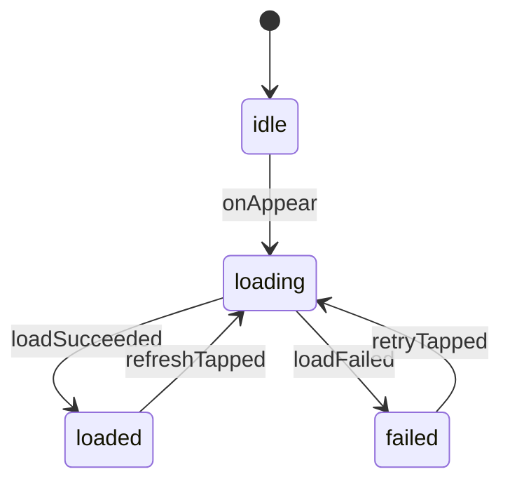

# Feature Design Sheet v1 (Sample)

> Example target: initial Todo list load + manual refresh

## 1. Basic Information

| Item | Content |
|---|---|
| Feature Name | Todo List Loading |
| Feature ID | FEAT-TODO-001 |
| Target Module | TodoFeature |
| Created At | 2026-03-08 |
| Updated At | 2026-03-08 |
| Author | Team StateObservation |
| Related Screen | TodoListScreen |
| Related Issue | #123 |

## 2. Feature Meaning

### Role

- Let users understand current Todo status from a list
- Let users refresh for latest content
- Serve as an entry point of task management flow

### User Goal

- Identify tasks to do now
- Retry when load fails

### In-scope Information

| Type | Content |
|---|---|
| Primary | Todo items |
| Secondary | Last updated time / error message |

### Out-of-scope Information

- local edit input state from task editing screen
- unrelated domain state (e.g. billing)

## 3. Responsibility Definition

### Responsible for

- managing loading/success/failure state
- accepting `onAppear` / `refreshTapped` / `retryTapped`
- transitions and failure recovery

### Not responsible for

- API transport implementation (UseCase / Repository)
- persistence method decisions

### Responsibility Checklist

| Viewpoint | Content |
|---|---|
| Managed subject | Todo list fetch flow |
| Input (Action) | onAppear / refreshTapped / retryTapped / loadSucceeded / loadFailed |
| Output | state / message |
| Boundary | abstract via `FetchTodoListUseCaseProtocol` |
| Exception policy | transition to `failed` and allow retry |

## 4. Variation Design

### User Variations

| Pattern ID | Condition | Description |
|---|---|---|
| PAT-001 | normal user | full list + refresh |
| PAT-002 | read-only user | refresh disabled |

### Data/State Variations

| Pattern ID | Condition | Description |
|---|---|---|
| PAT-101 | first launch | show empty placeholder |
| PAT-102 | no data | show Empty View |

### Difference Matrix

| Viewpoint | Normal User | Read-only User |
|---|---|---|
| Rendering | list + refresh button | list only |
| Operation | refresh/retry available | no refresh, retry only |
| Transition | loaded -> loading exists | loaded -> loading blocked |

## 5. Input / Output Definition

### Input

| Item | Type | Required | Description |
|---|---|---|---|
| userMode | UserMode | Yes | user type |
| initialItems | [TodoItem]? | No | cached first paint |

### Output

| Item | Type | Description |
|---|---|---|
| state | TodoFeature.State | for UI rendering |
| route | TodoRoute? | navigation |
| message | ToastMessage? | notification |

## 6. Actions / Events

### User Actions

| Action | Description |
|---|---|
| onAppear | start initial load |
| refreshTapped | manual refresh |
| retryTapped | retry after failure |

### System Events

| Action | Description |
|---|---|
| loadSucceeded(items) | fetch succeeded |
| loadFailed(error) | fetch failed |

## 7. State Design

| State | Description | UI Meaning | Why this state exists |
|---|---|---|---|
| idle | initial | empty/skeleton | before first trigger |
| loading | fetching | loading indicator | prevent duplicate operation |
| loaded([TodoItem]) | ready | list rendered | success path |
| failed(ErrorViewData) | failed | error + retry | recoverable failure |

## 8. Transitions

### Transition Table

| Transition ID | Current | Action | Guard | Next | Notes |
|---|---|---|---|---|---|
| TR-001 | idle | onAppear | | loading | initial load |
| TR-002 | loading | loadSucceeded | items.count > 0 | loaded | render list |
| TR-003 | loading | loadSucceeded | items.isEmpty | loaded | render empty view |
| TR-004 | loading | loadFailed | | failed | error screen |
| TR-005 | loaded | refreshTapped | userMode == normal | loading | refetch |
| TR-006 | failed | retryTapped | | loading | retry |

### State Diagram

## 9. Side Effects

| Effect ID | Effect | Trigger (Transition ID) | Description | Success Action | Failure Action |
|---|---|---|---|---|---|
| EF-001 | fetchTodoList() | TR-001 / TR-005 / TR-006 | fetch list | loadSucceeded | loadFailed |

## 10. Implementation Mapping

| Design Element | Implementation |
|---|---|
| Feature | `TodoFeature` |
| State | `TodoFeature.State` |
| Action | `TodoFeature.Action` |
| Transition | `TodoTransition` + Machine |
| Side Effect | `FetchTodoListUseCase` |
| UI Rendering | `TodoListView` |

## 11. Automated Test Design

### State Transition Tests

| TC ID | Transition ID | Given | When | Then |
|---|---|---|---|---|
| TC-001 | TR-001 | idle | onAppear | loading |
| TC-002 | TR-002 | loading | loadSucceeded(items>0) | loaded |
| TC-003 | TR-004 | loading | loadFailed | failed |
| TC-004 | TR-006 | failed | retryTapped | loading |

### Variation Tests

| TC ID | Pattern ID | Condition | Expectation |
|---|---|---|---|
| TC-101 | PAT-001 | normal user | refreshTapped -> loading |
| TC-102 | PAT-002 | read-only user | refreshTapped is invalid transition |
| TC-103 | PAT-102 | empty result | Empty View displayed |

### Side Effect Tests

| TC ID | Effect ID | Viewpoint |
|---|---|---|
| TC-201 | EF-001 | dispatch loadSucceeded on success |
| TC-202 | EF-001 | dispatch loadFailed on failure |

### Design Traceability

| TC ID | Feature | Pattern | Transition | Effect |
|---|---|---|---|---|
| TC-001 | FEAT-TODO-001 | | TR-001 | EF-001 |
| TC-102 | FEAT-TODO-001 | PAT-002 | TR-005 (invalid) | |
| TC-202 | FEAT-TODO-001 | | TR-004 | EF-001 |

## 12. Versioned Feature Management

| Feature ID | Feature | Status | Added Ver | Removed Ver |
|---|---|---|---|---|
| FEAT-TODO-001 | initial loading | Active | v1.0.0 | |
| FEAT-TODO-002 | manual refresh | Active | v1.1.0 | |

## 13. Open Questions

| Item | Content | Priority |
|---|---|---|
| ERR-001 | timeout message copy | Medium |

## 14. Review

| Role | Name | Date |
|---|---|---|
| Designer | A. Designer | 2026-03-08 |
| Reviewer | B. Reviewer | 2026-03-08 |
| Developer | C. Developer | 2026-03-08 |
